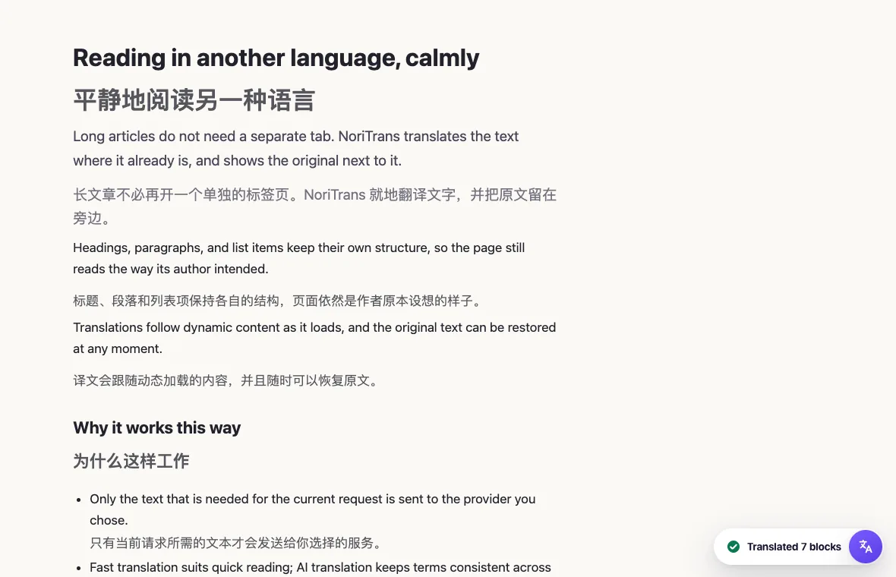
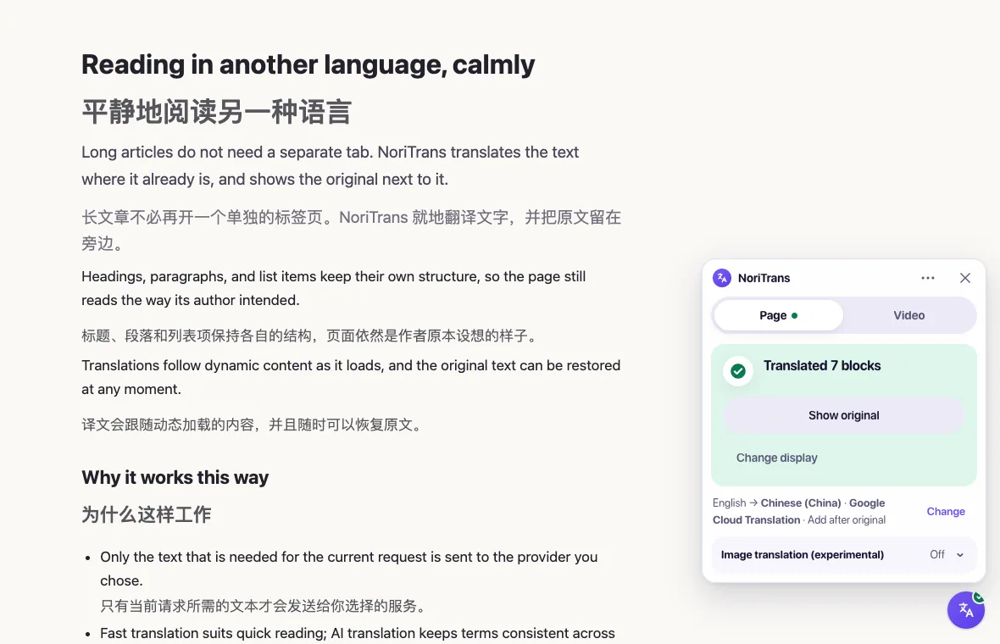
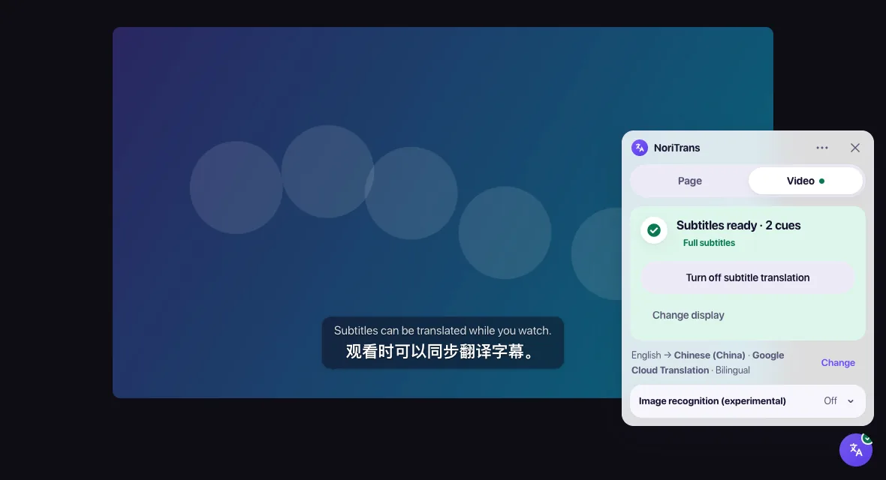
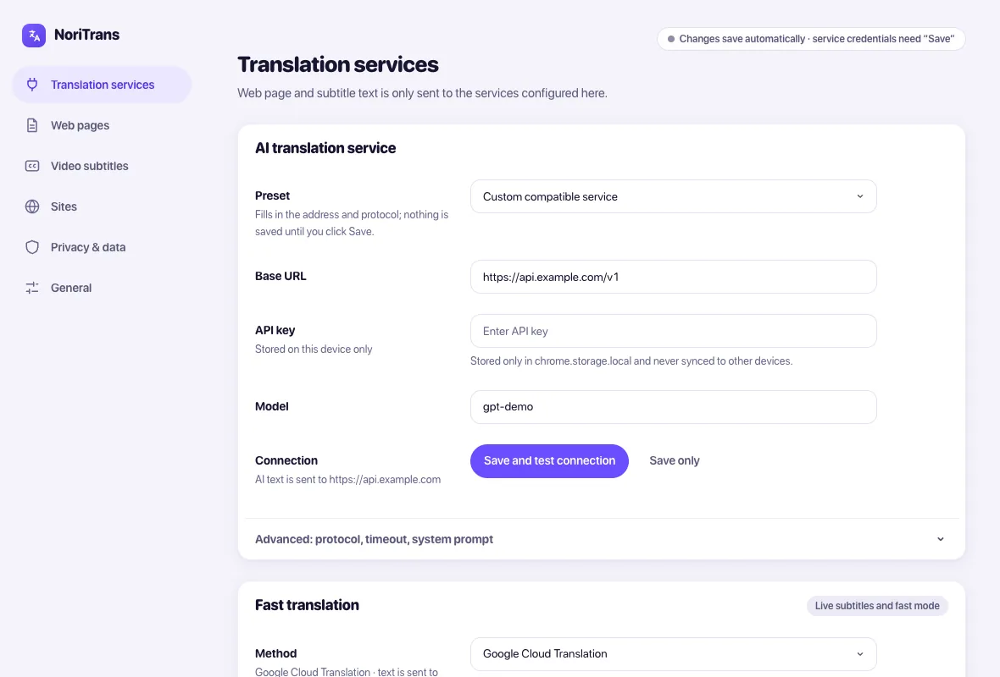
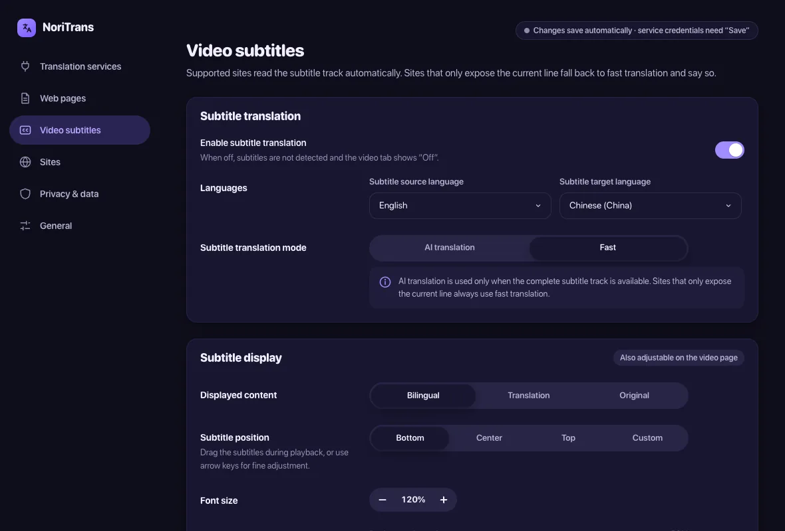
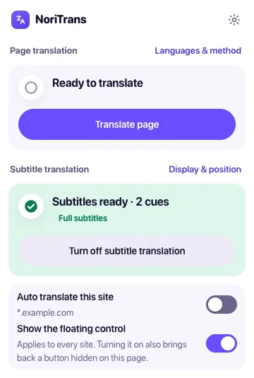

<p align="center">
  
</p>
<h1 align="center">NoriTrans</h1>
<p align="center">
  <strong>Translate webpages and video subtitles in Chrome, with the provider and the privacy boundaries you choose.</strong><br />
  Webpage translation, live subtitle translation, AI pretranslation of complete subtitle tracks, and an optional on-device OCR for burned-in captions. Bring your own provider.
</p>
<p align="center">
  <a href="https://github.com/Norixor/NoriTrans/releases/latest"></a>
  <a href="https://github.com/Norixor/NoriTrans/releases"></a>
  <a href="#installation"></a>
  <a href="LICENSE"></a>
  <a href="https://github.com/Norixor/NoriTrans/stargazers"></a>
</p>
<p align="center">
  <a href="https://github.com/Norixor/NoriTrans/releases/latest">Download</a> ·
  <a href="CONTRIBUTING.md">Contributing</a> ·
  <a href="SECURITY.md">Security</a> ·
  <a href="https://github.com/Norixor/NoriTrans/issues">Feedback</a>
</p>
<p align="center">English · <a href="README.zh-CN.md">简体中文</a></p>



> [!IMPORTANT]
> NoriTrans is a `0.x` project under active development. It targets desktop Chrome 138+ and Manifest V3. Site-specific subtitle integrations may need maintenance when streaming platforms change their players or private interfaces.

## Contents

- [About](#about)
- [Installation](#installation)
- [Quick start](#quick-start)
- [Key features](#key-features)
- [Preview](#preview)
- [Translation modes and subtitle sources](#translation-modes-and-subtitle-sources)
- [Providers, privacy, and permissions](#providers-privacy-and-permissions)
- [Development from source](#development-from-source)
- [Project layout](#project-layout)
- [Contributing and security](#contributing-and-security)
- [Acknowledgements](#acknowledgements)
- [License](#license)
- [Star History](#star-history)

## About

Reading a foreign-language page or watching a video with subtitles usually means switching tools, and every tool has its own idea of where your text goes. NoriTrans keeps webpage translation, video subtitle translation, and optional local OCR in one extension, but treats them as different problems: pages are translated in place and can be restored, complete subtitle tracks are pretranslated, and a live caption is translated only as fast as it appears. Which service receives your text is always your configuration, and the interface says so.

The interface is available in English and Simplified Chinese.

## Installation

NoriTrans is not listed in the Chrome Web Store. Install a release package manually:

1. Download `noritrans-<version>-chrome.zip` from [GitHub Releases](https://github.com/Norixor/NoriTrans/releases/latest).
2. Extract the archive.
3. Open `chrome://extensions` and turn on **Developer mode**.
4. Choose **Load unpacked** and select the extracted folder.
5. Confirm the version on `chrome://extensions`, then pin NoriTrans to the toolbar if you want quick access to its popup.

To update, load the new release the same way and refresh the pages that are already open. The extension can check GitHub Releases for a newer version; that request carries no page, subtitle, image, credential, or translation text.

## Quick start

1. Open the NoriTrans settings and choose a translation service under **Translation services**. Fast translation can use Chrome's local Translator API, downloadable local language packs, Google Cloud Translation, Microsoft Translator, or DeepL; AI translation needs a Base URL, API key, and model for an OpenAI-compatible or Anthropic Claude Messages service. Credentials stay on this device.
2. On any HTTPS page, use the floating button, the toolbar popup, or `Alt+Shift+T` to translate the page. `Alt+Shift+R` restores the original text.
3. On a page with a video, switch to the **Video** tab of the floating control to see whether subtitles were found and whether the track is complete.

## Key features

- **Webpage translation.** Translates semantic text nodes without replacing the page's HTML. It follows dynamic content and single-page-app navigation, shows the translation in place or after the original, and restores only what it changed.
- **Video subtitles.** Reads an existing subtitle source (HTML5 `TextTrack`, subtitle files, supported site interfaces, or the caption on screen) and shows an original, translated, or bilingual overlay.
- **Fast translation and AI translation.** Fast translation suits low-latency reading and live captions. AI translation keeps terms and tone consistent across long pages and complete subtitle tracks, with bounded batches, progressive results, cancellation, and caching.
- **Complete tracks and live captions, kept apart.** A `full` track can be pretranslated and cached. A `stream` track, where only the current caption is visible, always falls back to fast translation and the interface says so.
- **Optional local OCR.** For burned-in image subtitles, recognition starts only after you enable it and select a region of the video. Screenshots and recognized text stay on the device.
- **Selection and image translation.** Translate selected text on demand. The experimental image translation recognizes text in visible page images locally and sends only the recognized text to the selected provider.
- **One compact control.** A draggable floating control, isolated in a Shadow DOM, gives quick access to the page and video settings; it can be hidden for one page or permanently.

NoriTrans does not generate subtitles from audio, dub video, or download subtitle files.

## Preview





<table>
  <tr>
    <td width="50%"></td>
    <td width="50%"></td>
  </tr>
</table>

<p align="center">
  
</p>

The screenshots use self-written sample pages and a synthetic video track; no third-party video, subtitle, or brand content is shown.

## Translation modes and subtitle sources

| Mode             | Intended use                                                          | Behavior                                                                                              |
| ---------------- | --------------------------------------------------------------------- | ----------------------------------------------------------------------------------------------------- |
| Fast translation | Live captions, DOM captions, OCR, and low-latency webpage translation | Uses the configured fast provider. Stream-only subtitles never consume AI batches.                    |
| AI translation   | Context-sensitive webpages and complete subtitle tracks               | Uses stable segment IDs, bounded batches, progressive results, validation, cancellation, and caching. |

Subtitle tracks are classified as either:

- **`full`**: a complete timeline is available and can be pretranslated and cached.
- **`stream`**: only captions seen during playback are available. The interface reports that it has fallen back to fast translation.

NoriTrans prefers complete sources and falls back step by step:

1. HTML5 `TextTrack`;
2. WebVTT, TTML, timed-text, or a finite subtitle manifest;
3. a controlled MAIN-world network hook for supported sites;
4. a built-in or user-created DOM profile;
5. user-initiated local OCR when no readable subtitle source exists.

The repository includes 20 built-in profiles: standard HTML5, a generic DOM heuristic, YouTube, Netflix, Max/HBO Max, Disney+/Hotstar, Prime Video, Apple TV+, Hulu, Paramount+, Discovery+, Peacock, fuboTV, TED, BBC iPlayer, ZDF, Deutsche Welle, Udemy, Kanopy, and TVer. A bundled profile describes a subtitle acquisition strategy; it does not claim that each third-party site was verified live for every release.

## Providers, privacy, and permissions

| Capability                   | Processing location                           | Data sent externally                                                                    |
| ---------------------------- | --------------------------------------------- | --------------------------------------------------------------------------------------- |
| Chrome local translation     | Chrome's local model runtime                  | No text is sent to the configured AI provider. Chrome may download language models.     |
| Downloaded local translation | Extension-origin Bergamot runtime             | Directional packs install only after an explicit click; translated text stays local.    |
| AI translation               | The standard model API configured by the user | Only the text segments and bounded translation context required for the active request. |
| Google, Microsoft, or DeepL  | The selected official provider API            | Only the text segments required for the active fast-translation request.                |
| Local subtitle OCR           | Extension-origin Offscreen Document           | Screenshots and recognized text are not uploaded and cannot be sent to an AI provider.  |
| Version update check         | GitHub Releases API                           | No webpage, subtitle, image, provider credential, or translation text is sent.          |

Additional guarantees:

- API keys are stored in `chrome.storage.local`, never in source code or synchronized storage.
- Cloud requests are made by the background service worker, not by webpage content scripts.
- Provider diagnostics are bounded and exclude API keys, authorization headers, full source text, and raw response bodies.
- Clearing the translation cache and clearing credentials are separate actions.
- OCR models are downloaded only after an explicit click, from pinned sources, and verified against pinned SHA-256 values.
- The extension does not use `eval`, `new Function`, or remotely hosted executable code.

### Permissions

NoriTrans declares the required host permission `https://*/*` because the floating control and webpage/video translation must work on HTTPS pages without a toolbar click first. It does not request cookie, browsing-history, or audio-capture permissions.

Other declared permissions: `storage` and `unlimitedStorage` (settings, credentials, the local translation cache, and downloaded local components), `activeTab` and `scripting` (start NoriTrans on the current page), `offscreen` (the extension-origin document that runs local OCR and local translation), and `declarativeNetRequestWithHostAccess`. The last one removes the browser's automatic `Origin` header from the extension's own requests to the configured translation provider, so gateways that reject browser-origin requests with an API key accept them like any server client. It applies only to Provider hosts already covered by host permissions; pages' own requests are never modified.

Optional host permissions are requested only for the related action:

- `<all_urls>` for user-initiated visible-tab OCR capture;
- pinned GitHub asset origins for explicit OCR model downloads;
- pinned Mozilla catalog and attachment origins for explicit local translation pack downloads;
- `http://localhost/*` and `http://127.0.0.1/*` for a user-configured local provider.

## Development from source

Requirements:

- Chrome 138 or newer;
- Node.js `>=22.22.2 <23` or `>=24.15.0 <25`;
- pnpm `10.32.1`.

```bash
git clone https://github.com/Norixor/NoriTrans.git
cd NoriTrans
corepack enable
corepack prepare pnpm@10.32.1 --activate
pnpm install --frozen-lockfile
pnpm build
```

Then open `chrome://extensions`, turn on **Developer mode**, choose **Load unpacked**, and select `.output/chrome-mv3`. Unpacked builds do not update automatically.

```bash
pnpm dev             # WXT development build
pnpm check           # ESLint, TypeScript, unit tests, and production build
pnpm format:check    # repository-wide Prettier check
pnpm test:e2e        # synthetic Manifest V3 acceptance tests in Chromium
pnpm zip             # versioned extension archive
```

The standard E2E suite uses synthetic pages and short subtitle fixtures. It does not replace release-time checks on real signed-in streaming sites. The full OCR capture test also needs the pinned local runtime files:

```bash
NORITRANS_OCR_RUNTIME_DIR=/absolute/path/to/runtime pnpm test:e2e:ocr
```

Without that runtime the command reports a skip; a skipped OCR test is not a successful OCR acceptance result.

## Project layout

NoriTrans uses WXT, strict TypeScript, native HTML/CSS, Chrome Manifest V3, Vitest, and Playwright. It intentionally does not use a UI framework or remotely hosted executable code.

```text
entrypoints/     Extension pages, content scripts, and the background worker
src/page/        Webpage scanning, sessions, rendering, and restoration
src/subtitles/   Subtitle profiles, adapters, parsers, timeline, and overlay
src/translation/ Providers, scheduling, validation, and protected text
src/ocr/         Local capture, runtime, preprocessing, and recognition
src/cache/       Background-origin IndexedDB storage
src/messaging/   Cross-context protocol and validation
src/shared/      Settings, errors, diagnostics, and shared controls
assets/          Branding and README screenshots
```

See [`AGENTS.md`](AGENTS.md) for product contracts and acceptance boundaries.

## Contributing and security

Read [`CONTRIBUTING.md`](CONTRIBUTING.md) before opening a pull request and follow the [`CODE_OF_CONDUCT.md`](CODE_OF_CONDUCT.md). Report vulnerabilities privately as described in [`SECURITY.md`](SECURITY.md); do not publish credentials, private text, full subtitles, or exploitable details in a public issue.

## Acknowledgements

NoriTrans is built with [WXT](https://github.com/wxt-dev/wxt), `idb`, ONNX Runtime Web, Bergamot, and a packaged PaddleOCR-compatible runtime. OCR and local translation runtime notices are stored alongside their packaged assets.

## License

Unless otherwise noted, source code and documentation are licensed under the [Apache License 2.0](LICENSE). Copyright 2026 Norixor.

The NoriTrans name, logo, product identity, and files under `assets/branding/` are not licensed under Apache-2.0. See [`TRADEMARKS.md`](TRADEMARKS.md) for the brand-use policy. See [`NOTICE`](NOTICE) for attribution notices.

## Star History

<a href="https://www.star-history.com/?repos=norixor%2Fnoritrans&type=date&legend=top-left">
  <picture>
    <source media="(prefers-color-scheme: dark)" srcset="https://api.star-history.com/chart?repos=norixor/noritrans&type=date&theme=dark&legend=top-left" />
    <source media="(prefers-color-scheme: light)" srcset="https://api.star-history.com/chart?repos=norixor/noritrans&type=date&legend=top-left" />
    
  </picture>
</a>
