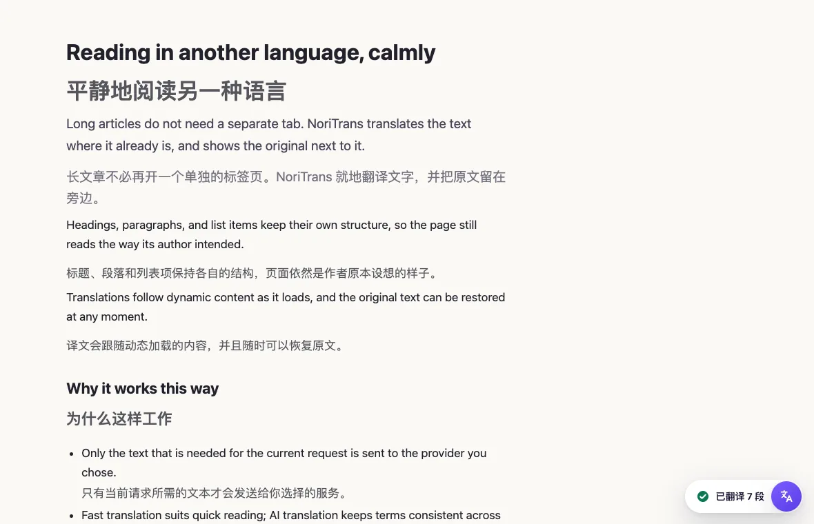
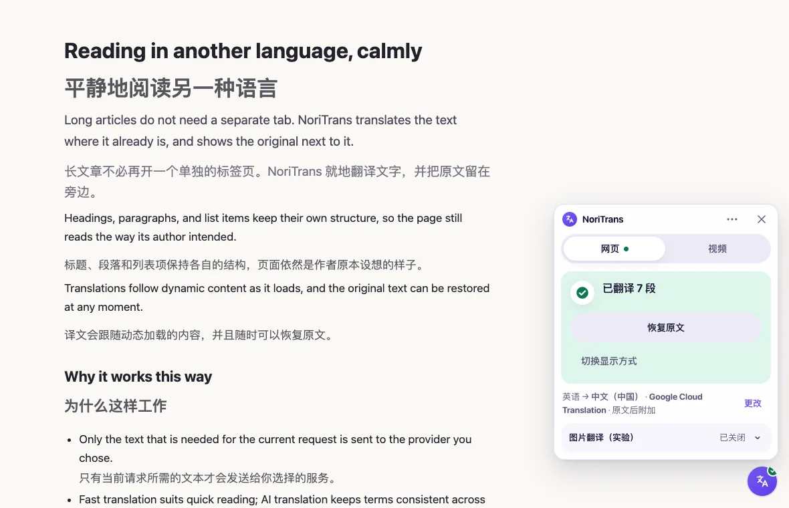
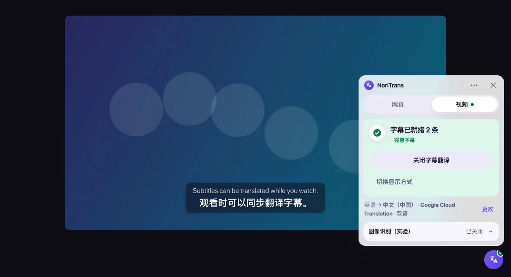
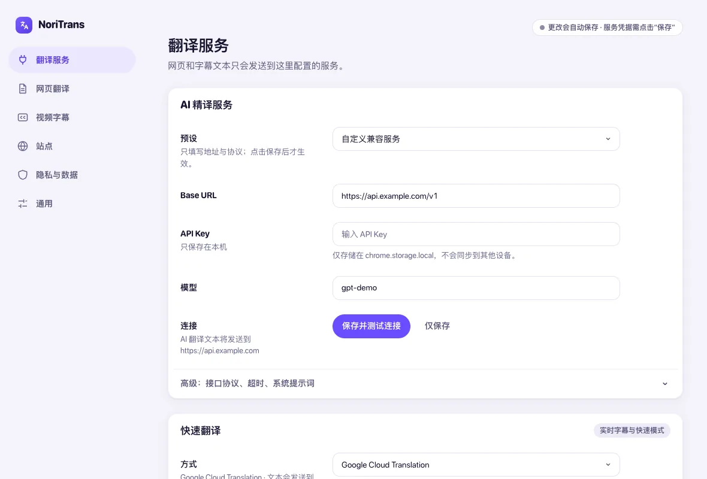
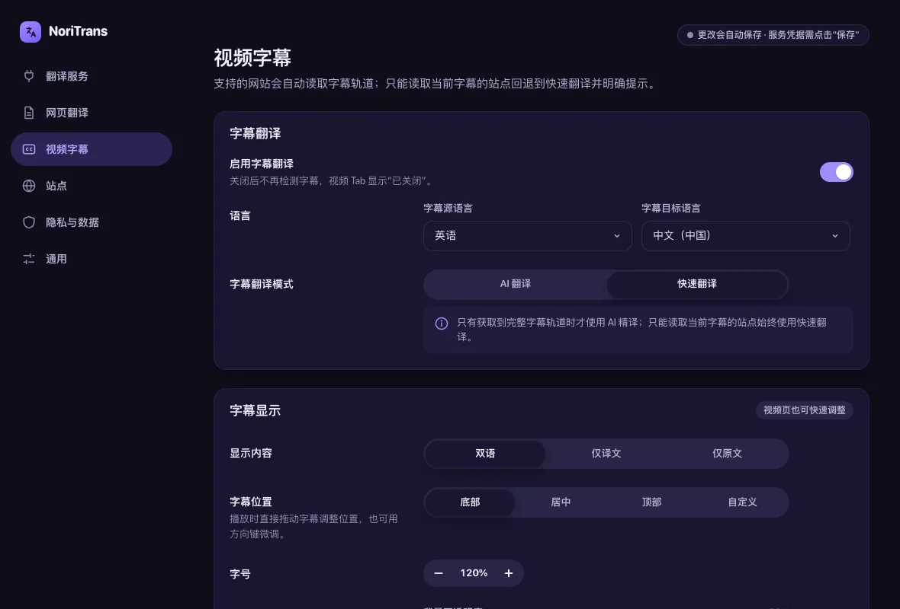
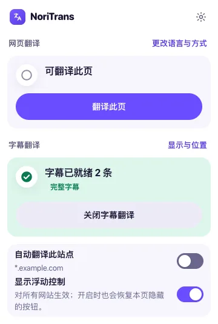

<p align="center">
  
</p>
<h1 align="center">NoriTrans</h1>
<p align="center">
  <strong>在 Chrome 中翻译网页和视频字幕，翻译服务与隐私边界由你决定。</strong><br />
  网页翻译、实时字幕翻译、完整字幕轨道的 AI 预翻译，以及可选的本地 OCR 烧录字幕识别。使用你自己的翻译服务。
</p>
<p align="center">
  <a href="https://github.com/Norixor/NoriTrans/releases/latest"></a>
  <a href="https://github.com/Norixor/NoriTrans/releases"></a>
  <a href="#安装"></a>
  <a href="LICENSE"></a>
  <a href="https://github.com/Norixor/NoriTrans/stargazers"></a>
</p>
<p align="center">
  <a href="https://github.com/Norixor/NoriTrans/releases/latest">下载</a> ·
  <a href="CONTRIBUTING.md">参与贡献</a> ·
  <a href="SECURITY.md">安全政策</a> ·
  <a href="https://github.com/Norixor/NoriTrans/issues">反馈</a>
</p>
<p align="center"><a href="README.md">English</a> · 简体中文</p>



> [!IMPORTANT]
> NoriTrans 是仍在积极开发的 `0.x` 项目，面向桌面 Chrome 138+ 和 Manifest V3。流媒体网站修改播放器或私有接口后，站点专用字幕适配可能需要同步维护。

## 目录

- [简介](#简介)
- [安装](#安装)
- [快速开始](#快速开始)
- [主要功能](#主要功能)
- [界面预览](#界面预览)
- [翻译模式与字幕来源](#翻译模式与字幕来源)
- [翻译服务、隐私与权限](#翻译服务隐私与权限)
- [从源码开发](#从源码开发)
- [项目结构](#项目结构)
- [参与贡献与安全](#参与贡献与安全)
- [致谢](#致谢)
- [许可证](#许可证)
- [Star History](#star-history)

## 简介

阅读外文网页，或观看带字幕的视频，往往要在不同工具之间切换，而每个工具对“文字会发送到哪里”都有自己的做法。NoriTrans 把网页翻译、视频字幕翻译和可选的本地 OCR 放在同一个扩展里，但不把它们当成同一个问题：网页就地翻译且可以恢复，完整字幕轨道会预翻译，实时字幕则只按它出现的速度翻译。文字发送给哪个服务始终由你的配置决定，界面也会明确说明。

界面支持英文和简体中文。

## 安装

NoriTrans 尚未上架 Chrome 网上应用店，请手动安装发布包：

1. 从 [GitHub Releases](https://github.com/Norixor/NoriTrans/releases/latest) 下载 `noritrans-<version>-chrome.zip`。
2. 解压压缩包。
3. 打开 `chrome://extensions`，启用**开发者模式**。
4. 点击**加载已解压的扩展程序**，选择解压后的文件夹。
5. 在 `chrome://extensions` 中确认版本号，需要快速访问弹窗时可将 NoriTrans 固定到工具栏。

更新时按同样方式加载新版本，并刷新已经打开的页面。扩展可以检查 GitHub Releases 是否有新版本，这个请求不包含网页、字幕、图像、凭据或翻译文本。

## 快速开始

1. 打开 NoriTrans 设置，在**翻译服务**中选择翻译服务。快速翻译可使用 Chrome 本地 Translator API、可下载的本地语言包、Google Cloud Translation、Microsoft Translator 或 DeepL；AI 翻译需要为 OpenAI-compatible 或 Anthropic Claude Messages 服务填写 Base URL、API Key 和模型。凭据只保存在本机。
2. 在任意 HTTPS 页面，可通过浮窗按钮、工具栏弹窗或 `Alt+Shift+T` 翻译网页；`Alt+Shift+R` 恢复原文。
3. 页面包含视频时，切换到浮窗的**视频**标签，查看是否找到字幕以及字幕轨道是否完整。

## 主要功能

- **网页翻译：** 基于语义文本节点工作，不替换页面的 HTML。支持动态内容和单页应用导航，可就地显示译文或在原文后附加译文，并且只恢复自己修改过的内容。
- **视频字幕：** 读取已有字幕来源（HTML5 `TextTrack`、字幕文件、受支持的站点接口或屏幕上的当前字幕），以原文、译文或双语叠层显示。
- **快速翻译与 AI 翻译：** 快速翻译适合低延迟阅读和实时字幕；AI 翻译让长网页和完整字幕轨道的术语、语气保持一致，采用有界批次、渐进结果、取消和缓存。
- **完整轨道与实时字幕分开处理：** `full` 轨道可以预翻译并缓存；只能看到当前字幕的 `stream` 轨道始终回退到快速翻译，界面会明确说明。
- **可选的本地 OCR：** 针对烧录在画面里的图像字幕，只有用户主动启用并框选视频区域后才开始识别，截图和识别文字始终留在本机。
- **划词翻译与图片翻译：** 可按需翻译选中的文字。实验性的图片翻译在本地识别可见图片中的文字，只把识别出的文字发送给所选翻译服务。
- **统一浮窗：** 可拖动、通过 Shadow DOM 隔离的浮窗，用于快速调整网页和视频设置；可以只在当前页面隐藏，也可以永久隐藏。

NoriTrans 不会从音频生成字幕，不提供 AI 配音，也不下载字幕文件。

## 界面预览





<table>
  <tr>
    <td width="50%"></td>
    <td width="50%"></td>
  </tr>
</table>

<p align="center">
  
</p>

截图使用自行编写的示例页面和合成视频字幕轨道，不包含任何第三方视频、字幕或品牌内容。

## 翻译模式与字幕来源

| 模式     | 适用场景                                 | 行为                                                        |
| -------- | ---------------------------------------- | ----------------------------------------------------------- |
| 快速翻译 | 实时字幕、DOM 字幕、OCR 和低延迟网页翻译 | 使用配置的快速 Provider；流式字幕不会消耗 AI 批处理请求。   |
| AI 翻译  | 需要上下文的网页和完整字幕轨道           | 使用稳定段落 ID、有界批次、渐进结果、严格校验、取消和缓存。 |

字幕轨道会明确区分为：

- **`full`：** 已取得完整时间轴，可以预翻译和缓存。
- **`stream`：** 只能获得播放期间已经出现的字幕，界面会提示已回退快速翻译。

NoriTrans 优先使用完整来源，再逐级回退：

1. HTML5 `TextTrack`；
2. WebVTT、TTML、timed-text 或有限字幕 manifest；
3. 受控的 MAIN world 网络拦截（仅限受支持站点）；
4. 内置或用户创建的 DOM Profile；
5. 没有可读字幕时，由用户主动启动本地 OCR。

仓库内置 20 个 Profile：标准 HTML5、通用 DOM 启发式、YouTube、Netflix、Max/HBO Max、Disney+/Hotstar、Prime Video、Apple TV+、Hulu、Paramount+、Discovery+、Peacock、fuboTV、TED、BBC iPlayer、ZDF、Deutsche Welle、Udemy、Kanopy 和 TVer。内置 Profile 只表示已经声明相应的字幕采集策略，不代表每个版本都完成了第三方真实站点的线上验收。

## 翻译服务、隐私与权限

| 能力                     | 处理位置                          | 会发送到外部的数据                                            |
| ------------------------ | --------------------------------- | ------------------------------------------------------------- |
| Chrome 本地翻译          | Chrome 本地模型运行时             | 不会把文字发送给配置的 AI Provider；Chrome 可能下载语言模型。 |
| 下载式本地翻译           | 扩展 origin 的 Bergamot 运行时    | 按方向的语言包只在用户点击后安装，待译文字始终留在本机。      |
| AI 翻译                  | 用户配置的标准模型接口            | 仅发送当前任务需要的文本段和有界上下文。                      |
| Google、Microsoft、DeepL | 用户选择的官方 Provider API       | 仅发送当前快速翻译任务需要的文本段。                          |
| 本地图像字幕 OCR         | 扩展 origin 的 Offscreen Document | 截图和识别文字不上传，也不允许发送给 AI Provider。            |
| 版本更新检查             | GitHub Releases API               | 不发送网页、字幕、图像、Provider 凭据或翻译文本。             |

额外保证：

- API Key 只保存在 `chrome.storage.local`，不会写入源码或同步存储。
- 云端请求由 Background Service Worker 发起，不由网页 Content Script 直接调用。
- Provider 诊断是有界信息，不包含 API Key、认证头、完整原文或原始响应正文。
- 清除翻译缓存和清除凭据是两个独立操作。
- OCR 模型只会在用户明确点击后从固定来源下载，并校验固定 SHA-256。
- 扩展不使用 `eval`、`new Function` 或远程托管的可执行代码。

### 权限说明

NoriTrans 声明必需主机权限 `https://*/*`，因为统一浮窗以及网页、视频翻译需要在用户未先点击工具栏图标时也能在 HTTPS 页面工作。项目不申请 Cookie、浏览历史或音频捕获权限。

其他已声明权限：`storage` 和 `unlimitedStorage`（设置、凭据、本地翻译缓存和已下载的本地组件），`activeTab` 和 `scripting`（在当前页面启动 NoriTrans），`offscreen`（运行本地 OCR 与本地翻译的扩展 origin 文档），以及 `declarativeNetRequestWithHostAccess`。最后一项用于在 NoriTrans 自己发往已配置翻译 Provider 的请求中移除浏览器自动附加的 `Origin` 请求头，使拒绝“浏览器来源 + API Key”请求的网关能像对待普通服务端客户端一样接受请求。它只作用于已被主机权限覆盖的 Provider 主机，从不修改网页自身的请求。

以下可选主机权限只会在对应操作中请求：

- `<all_urls>`：用户主动启动可见标签页 OCR 截图；
- 固定 GitHub 资源域名：用户明确下载 OCR 模型；
- 固定 Mozilla 目录与附件域名：用户明确下载本地翻译语言包；
- `http://localhost/*` 和 `http://127.0.0.1/*`：用户配置本地 Provider。

## 从源码开发

环境要求：

- Chrome 138 或更高版本；
- Node.js `>=22.22.2 <23` 或 `>=24.15.0 <25`；
- pnpm `10.32.1`。

```bash
git clone https://github.com/Norixor/NoriTrans.git
cd NoriTrans
corepack enable
corepack prepare pnpm@10.32.1 --activate
pnpm install --frozen-lockfile
pnpm build
```

然后打开 `chrome://extensions`，启用**开发者模式**，点击**加载已解压的扩展程序**，选择 `.output/chrome-mv3`。源码构建不会自动更新。

```bash
pnpm dev             # WXT 开发构建
pnpm check           # ESLint、TypeScript、单测和生产构建
pnpm format:check    # 全仓 Prettier 检查
pnpm test:e2e        # Chromium 中的合成 Manifest V3 验收
pnpm zip             # 生成版本化扩展压缩包
```

标准 E2E 使用项目自建页面和短字幕夹具，不替代发布前对真实登录流媒体站点的检查。完整 OCR 截图链路还需要固定版本的本地运行时文件：

```bash
NORITRANS_OCR_RUNTIME_DIR=/absolute/path/to/runtime pnpm test:e2e:ocr
```

没有提供运行时时，命令会明确报告跳过；跳过不等于 OCR 验收成功。

## 项目结构

NoriTrans 使用 WXT、TypeScript strict mode、原生 HTML/CSS、Chrome Manifest V3、Vitest 和 Playwright。项目不使用 UI 框架，也不允许远程加载可执行代码。

```text
entrypoints/     扩展页面、Content Script 和 Background Worker
src/page/        网页扫描、会话、渲染和恢复
src/subtitles/   字幕 Profile、Adapter、Parser、时间轴和 Overlay
src/translation/ Provider、调度、结果校验和保护文本
src/ocr/         本地截图、运行时、预处理和识别
src/cache/       Background origin 的 IndexedDB 存储
src/messaging/   跨上下文消息协议和校验
src/shared/      设置、错误、诊断和共享控件
assets/          品牌资源和 README 截图
```

产品契约和验收边界见 [`AGENTS.md`](AGENTS.md)。

## 参与贡献与安全

提交 Pull Request 前请阅读 [`CONTRIBUTING.md`](CONTRIBUTING.md)，并遵守 [`CODE_OF_CONDUCT.md`](CODE_OF_CONDUCT.md)。请按照 [`SECURITY.md`](SECURITY.md) 私下报告安全漏洞；不要在公开 issue 中发布凭据、私人文本、完整字幕或可被利用的细节。

## 致谢

NoriTrans 使用 [WXT](https://github.com/wxt-dev/wxt)、`idb`、ONNX Runtime Web、Bergamot，以及打包的 PaddleOCR 兼容运行时构建。OCR 和本地翻译运行时的许可声明与对应的打包资源放在一起。

## 许可证

除非另有说明，源码和文档采用 [Apache License 2.0](LICENSE)。Copyright 2026 Norixor。

NoriTrans 名称、标志、产品标识以及 `assets/branding/` 下的文件不适用 Apache-2.0。品牌使用政策见 [`TRADEMARKS.md`](TRADEMARKS.md)，署名声明见 [`NOTICE`](NOTICE)。

## Star History

<a href="https://www.star-history.com/?repos=norixor%2Fnoritrans&type=date&legend=top-left">
  <picture>
    <source media="(prefers-color-scheme: dark)" srcset="https://api.star-history.com/chart?repos=norixor/noritrans&type=date&theme=dark&legend=top-left" />
    <source media="(prefers-color-scheme: light)" srcset="https://api.star-history.com/chart?repos=norixor/noritrans&type=date&legend=top-left" />
    
  </picture>
</a>
